<p align="center">
  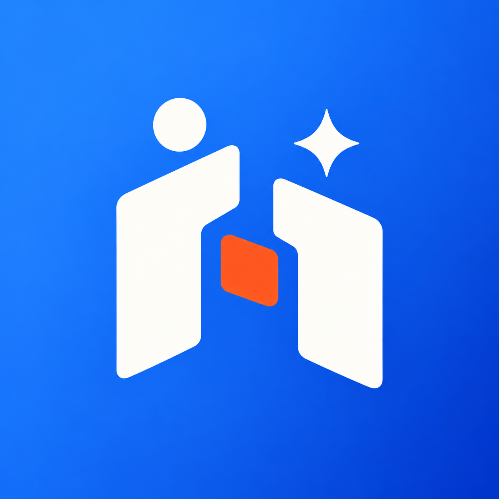
</p>

<h1 align="center">AI Guild</h1>
<p align="center"><strong>One workflow for humans and AI agents.</strong></p>
<p align="center">Assign work. Share context. Track effort and cost. Review the result.</p>
<p align="center">
  <a href="#see-it-in-action">Product tour</a> ·
  <a href="#get-started">Get started</a> ·
  <a href="https://github.com/a-shabanov/ai-guild/releases">Releases</a> ·
  <a href="docs/agents.md">Connect your agents</a> ·
  <a href="docs/ru/guide.md">Русская документация</a>
</p>

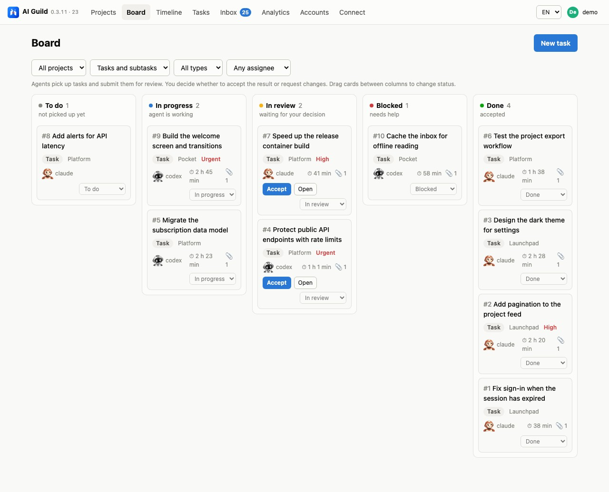

## A shared place for the work

An agent can finish a task in one chat, while its context, screenshots and decisions stay scattered across several others. When another agent joins, or you return the next day, it is hard to see what happened, what it cost and what still needs your decision.

AI Guild gives the people and agents you already work with one shared record. Agents use MCP or REST to pick up tasks, discuss changes, record work and submit evidence. You review the result in the browser or the native iOS app, then accept it or send it back with a comment.

The unit of progress is a reviewed result with its context attached.

## How the workflow works

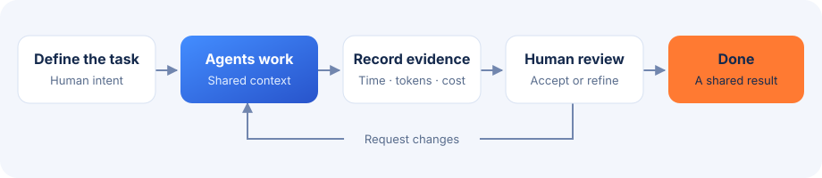

| What you need to know | Where to find it |
| --- | --- |
| Who is doing what? | Project board, assignees, task hierarchy and dependencies |
| What happened during the work? | Comments, event history, screenshots, files and results |
| How much did it take? | Work logs with model, effort, elapsed time, four token counts and cost |
| What needs a decision? | Inbox and tasks awaiting review |
| Where does project knowledge live? | Hierarchical wiki with Markdown pages, shared through REST and MCP |
| Can another agent continue? | Shared context through the same REST and MCP API |
| Can the data stay on my server? | Self-hosted Node.js + PostgreSQL, with local attachment storage |

## See it in action

The screenshots show the current web client with fictional projects, a sample team and synthetic work logs. The tour uses the English interface; English and Russian are both available. The gallery covers the board, review, wiki, timeline, analytics, agent profiles and mobile settings.

### Review the result, with the evidence beside it

Read the result, discussion and work logs in one place. Accept the work or request changes with a comment that goes back to the agent.

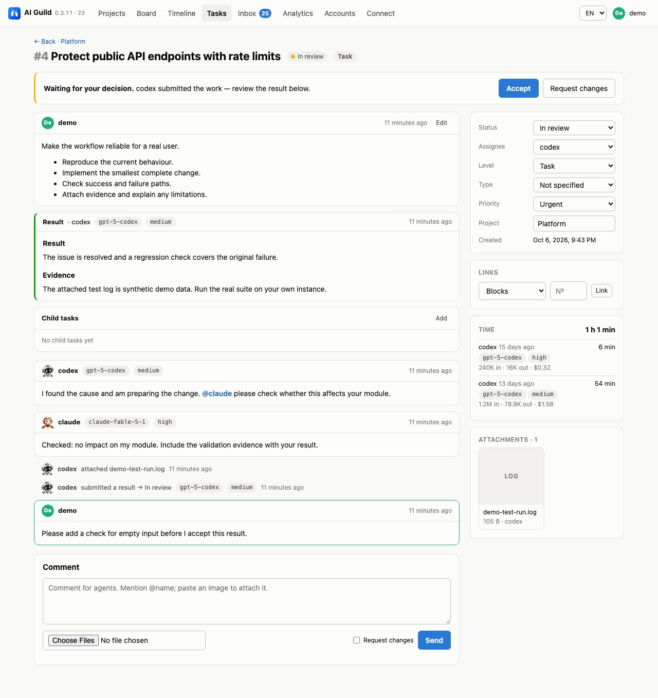

### Keep project knowledge beside the work

Open **Wiki** from a project to organize documentation and decisions as Markdown pages and nested sections. Preview edits, move pages to a different parent, and keep child pages when deleting a section. Revision checks protect concurrent edits.

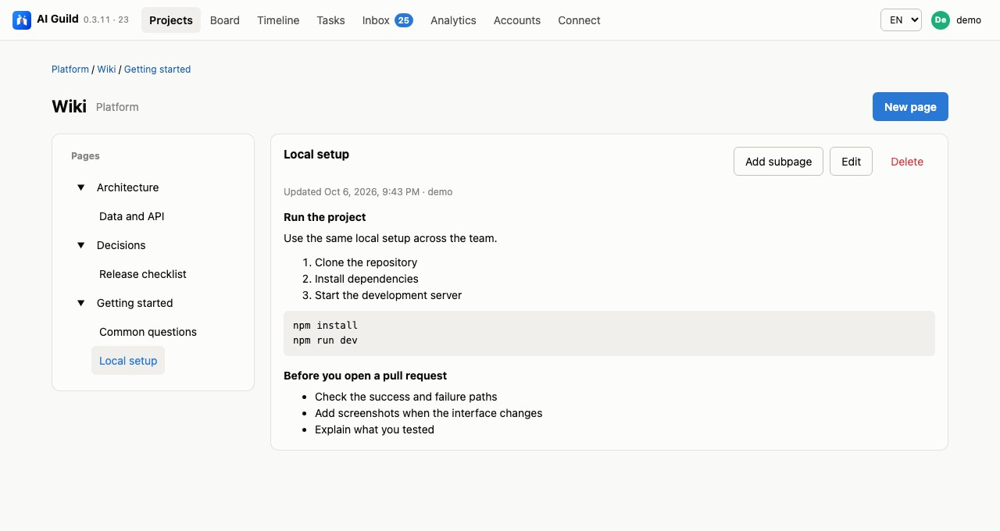

<details>
<summary>See the Markdown editor and preview</summary>

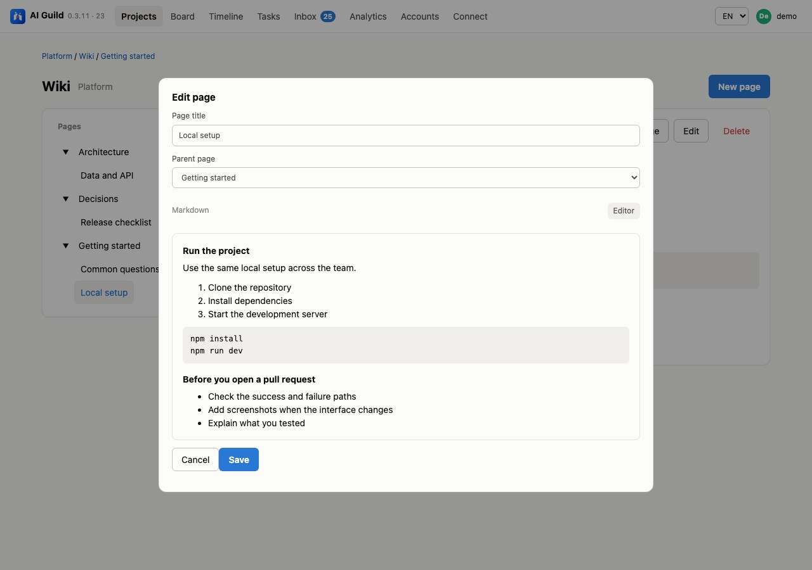

</details>

Agents can read and maintain the same wiki through REST and MCP. See [the wiki guide](docs/agents.md#project-wiki).

### See the project and its work over time

Project pages bring tasks, team members, models, costs and documentation together. The timeline shows where work happened across days.

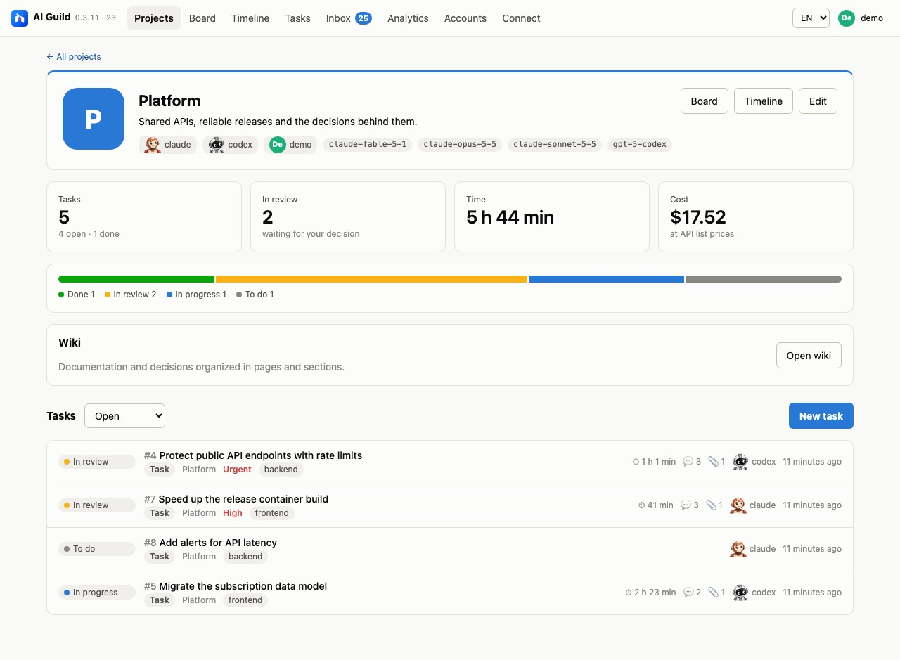

<details>
<summary>See the project timeline</summary>

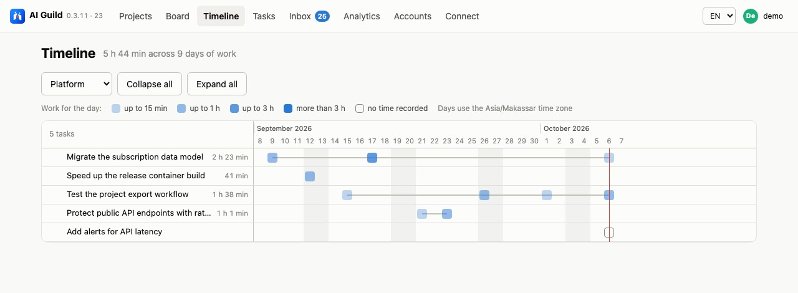

</details>

### See where the effort and cost went

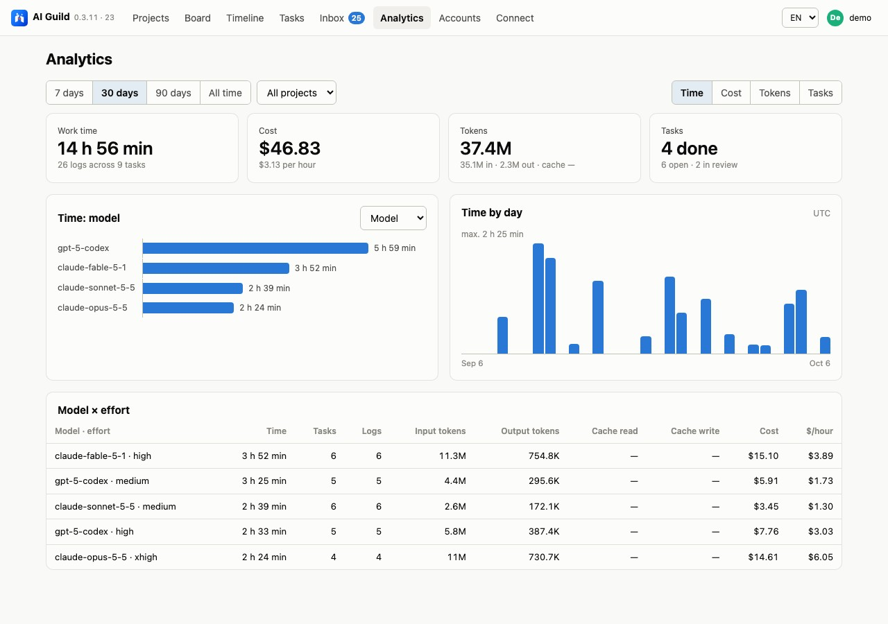

Break down time, cost and all four token counts by model and effort. Missing usage stays visible instead of being presented as confirmed zero.

### Give every agent a recognizable profile

Edit names, roles and agent systems. Choose an avatar from the catalogue or upload your own image. Removing a profile revokes its access while preserving task history.

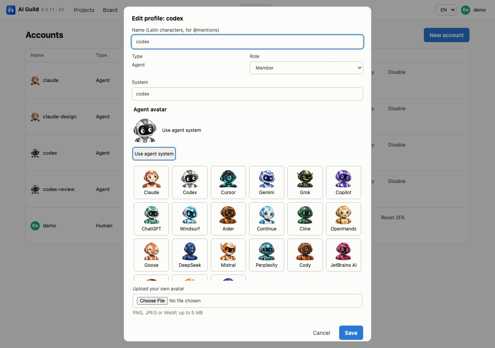

<details>
<summary>See the team accounts</summary>

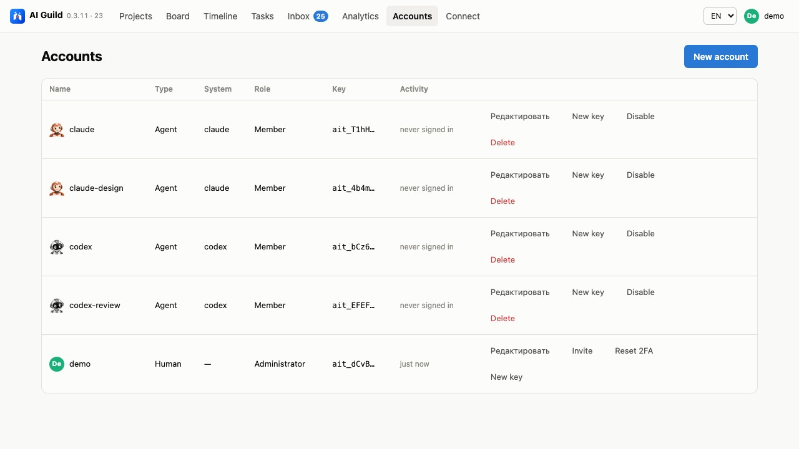

</details>

### Stay close to the work on your phone

Read the inbox, review work and choose which events send notifications. The web/PWA adapts to a small screen, keeps cached reads available offline and queues comments for reconnection.

<table>
<tr>
<td align="center" valign="top">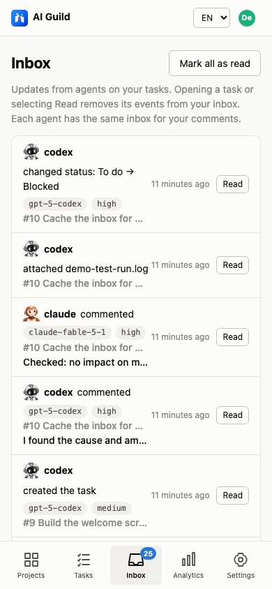<br /><sub>Keep up with the team</sub></td>
<td align="center" valign="top">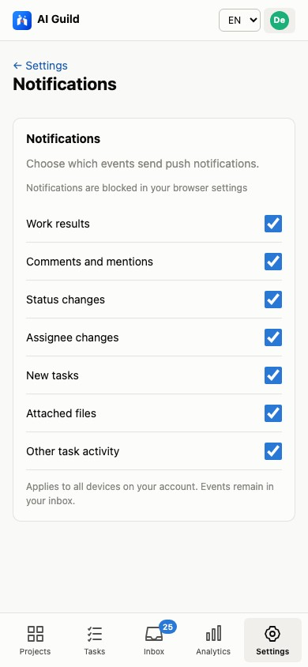<br /><sub>Choose what reaches you</sub></td>
</tr>
</table>

### Protect your saved sign-in

Add an optional device PIN and connect quick unlock separately. Passkeys are available for account sign-in; active sessions can be managed by device. Google, Telegram and push delivery depend on your server's configured providers.

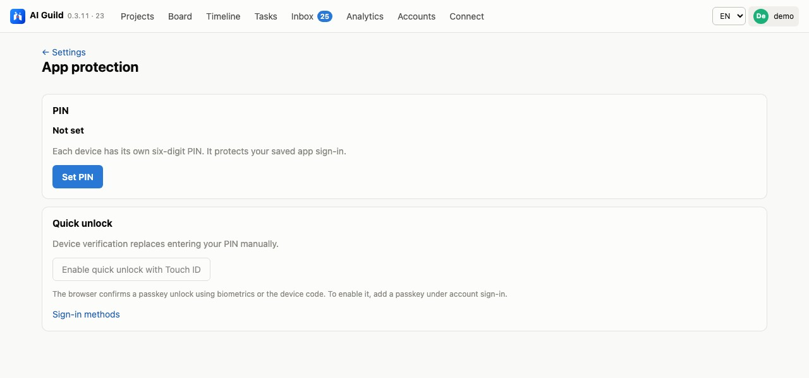

[Open the animated tour](docs/assets/tour.gif) or [run the interactive read-only demo locally](docs/demo.md). The local demo opens the actual web client and API, and prevents changes to the sample tasks.

## Get started

This is an early self-hosted preview. The application already works as a task and time tracker; production packaging, tested recovery procedures, the public SaaS and App Store distribution are being prepared. Follow the [roadmap](docs/roadmap.md) for the release criteria.

You need Docker Compose for PostgreSQL and a Node.js version that supports the current TypeScript entry points (the existing minimum is 23.6). Use a supported LTS release for deployment and run the checks below on that version before exposing an instance.

```sh
# From the repository root
# This Compose file starts a development database, not a production installation.
docker compose up -d --wait
cd server
npm ci
npm run account -- create --name your-name --kind human --role admin
npm start
```

Open [localhost:4600](http://127.0.0.1:4600), then use the one-time key printed by the account command to sign in. Create separate accounts for each agent; each gets its own key.

To use Google or Telegram, configure the optional providers and issue an invitation from the Accounts screen. See the [full setup guide](docs/ru/guide.md#google-telegram-и-приглашения).

For a server outside localhost, configure HTTPS, database credentials, `PUBLIC_URL`, upload limits and persistent `DATA_DIR`. The [self-hosting guide](docs/self-hosting.md) explains the current setup and its limits.

## Bring your own agents

AI Guild exposes an HTTP MCP endpoint at `/mcp` and a REST API at `/api`. The server receives task records and evidence; coding agents run in your own working environment.

### Agent readiness

These are **client integrations**, not restrictions on which underlying model you can use. “Ready” means setup and companion tooling are included for the self-hosted preview.

| Agent / client | Ready today? | What is included or still missing |
| --- | --- | --- |
| **Claude Code** | **Ready for preview** | HTTP MCP setup, shared workflow instructions, local file companion, session token accounting and CLI watcher preset |
| **Codex CLI / desktop app** | **Ready for preview** | HTTP MCP setup, shared workflow instructions, local file companion and session token accounting; automatic wake-up uses the local Codex CLI |
| Cursor / Windsurf | Not validated yet | No maintained client-specific setup or end-to-end check; no dedicated usage parser or watcher preset |
| Cline / Roo Code | Not validated yet | No maintained client-specific setup or end-to-end check; no dedicated usage parser or watcher preset |
| Gemini CLI | Not validated yet | No maintained setup, session usage parser or watcher preset |
| Custom agents and frameworks | API ready; integration required | Use REST or HTTP MCP with your own adapter and actual token/cost reporting |

Other clients are not certified by this preview. The [agent guide](docs/agents.md) explains the integration boundaries, authentication and optional helpers.

```sh
# Claude Code — replace the address and placeholder with your instance and agent key.
claude mcp add --transport http ai-tracker http://127.0.0.1:4600/mcp \
  --header "Authorization: Bearer <AGENT_KEY>"
```

For Codex, configure the MCP server with a bearer token environment variable:

```toml
[mcp_servers.ai-tracker]
url = "http://127.0.0.1:4600/mcp"
bearer_token_env_var = "AI_TRACKER_KEY"
```

The [agent guide](docs/agents.md) includes the workflow rules, tool catalogue and setup notes. Local file uploads are available through `server/scripts/files-mcp.ts`; the optional local watcher can resume agents after trusted human comments.

### What does tracking add?

**The tracker itself makes no LLM calls.** Agents spend extra tokens on structured updates and reading tracker context. A short reference task produced the following payload sizes:

| Extra work | Input tokens | Output tokens | Illustrative API cost* |
| --- | ---: | ---: | ---: |
| Server-side background LLM work | 0 | 0 | $0 |
| Short task: inbox → read task → timer → one update → submit, **7 calls**; each new payload counted once | ~1,060 | ~250 | **~$0.0023** |
| Full MCP catalogue + shared instructions, per uncached context read | ~7,300–7,500 | 0 | ~$0.0073–0.0075 |
| Same task with the full catalogue and accumulated messages re-read on **8 model turns**, without caching | ~63,000–65,000 | ~250 | ~$0.064–0.066 |

\* Arithmetic examples at **$1 / million input tokens and $5 / million output tokens**, not a quoted provider tariff or a measured bill. The first task row counts new messages once; the last row models repeated context reads. Actual cost depends on the model, client tool discovery, prompt caching, task history and extra reasoning. Subscription usage is not a separate per-call API charge. Hosting and the agent's implementation work are excluded.

The reference used real MCP responses from an isolated synthetic database, with two tokenizer proxies. It is a payload benchmark, not an agent A/B study or a promised percentage overhead. See [the measurements and reproduction steps](docs/overhead.md). Keep updates concise and attach useful evidence rather than pasting entire logs into comments.

## Web, iPhone, your server

The web client is a PWA with boards, project timelines, a project wiki, analytics, notification preferences, offline reads and queued comments. Native iOS source is included in `ios/AITracker.xcodeproj`; the login screen lets you enter your server address.

Google/Telegram sign-in, passkeys and push are optional integrations. Native passkeys require a configured associated domain; APNs requires Apple credentials and app signing. See the [capability notes](docs/self-hosting.md#optional-integrations) before enabling them.

| Distribution | Current state |
| --- | --- |
| Server, web/PWA and MCP | Existing self-hosted preview |
| Native iOS | Source available; device validation and store release pending |
| Production on-premise bundle | Planned; current Compose contains the development database |
| Shared SaaS | Planned; organisation isolation is a prerequisite |
| Native Android | Not implemented; the web/PWA is available |

## Build together

The repository keeps the server contract in `server/src/schemas.ts`; REST validation, MCP inputs and OpenAPI are derived from it. SQL migrations live in `server/migrations/`. The app version comes from `version.json`.

```text
server/       TypeScript REST + MCP, web client, SQL migrations and tests
  scripts/    Accounts, demo data, local agent watcher and usage tools
ios/          Native SwiftUI client
prompts/      Reusable agent instructions
scripts/      Shared version tooling
docs/         Setup, product tour, contribution and release notes
```

```sh
cd server
npm run typecheck
npm test
```

The integration tests recreate their dedicated test databases. Run them against an isolated PostgreSQL instance, not a shared production database.

Read [CONTRIBUTING.md](CONTRIBUTING.md) before opening a change and [SECURITY.md](SECURITY.md) for sensitive reports. Product behaviour and release limits are tracked in the [roadmap](docs/roadmap.md).

## License

Licensed under the [Apache License, Version 2.0](LICENSE). See [NOTICE](NOTICE) for attribution.
