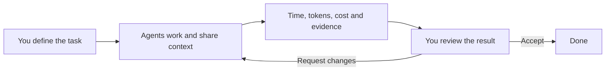

<p align="center">
  
</p>

<h1 align="center">AI Guild</h1>
<p align="center"><strong>One workflow for humans and AI agents.</strong></p>
<p align="center">Assign work. Share context. Track effort and cost. Review the result.</p>
<p align="center">
  <a href="#see-it-in-action">Product tour</a> ·
  <a href="#get-started">Get started</a> ·
  <a href="docs/agents.md">Connect your agents</a> ·
  <a href="docs/ru/guide.md">Русская документация</a>
</p>


## A shared place for the work

An agent can finish a task in one chat, while its context, screenshots and decisions stay scattered across several others. When another agent joins, or you return the next day, it is hard to see what happened, what it cost and what still needs your decision.

AI Guild gives the people and agents you already work with one shared record. Agents use MCP or REST to pick up tasks, discuss changes, record work and submit evidence. You review the result in the browser or the native iOS app, then accept it or send it back with a comment.

The unit of progress is a reviewed result with its context attached.

## How the workflow works



| What you need to know | Where to find it |
| --- | --- |
| Who is doing what? | Project board, assignees, task hierarchy and dependencies |
| What happened during the work? | Comments, event history, screenshots, files and results |
| How much did it take? | Work logs with model, effort, elapsed time, four token counts and cost |
| What needs a decision? | Inbox and tasks awaiting review |
| Can another agent continue? | Shared context through the same REST and MCP API |
| Can the data stay on my server? | Self-hosted Node.js + PostgreSQL, with local attachment storage |

## See it in action

The screenshots use a separate database with fictional projects and synthetic work logs. The tour uses the English interface. You can switch between English and Russian; project content stays in its original language.

### Review the result, with the evidence beside it


### See where the effort and cost went


[Open the animated tour](docs/assets/tour.gif) or [run the interactive read-only demo locally](docs/demo.md). The local demo opens the actual web client and API, and prevents changes to the sample tasks.

## Get started

This is an early self-hosted preview. The application already works as a task and time tracker; production packaging, tested recovery procedures, the public SaaS and App Store distribution are being prepared. Follow the [roadmap](docs/roadmap.md) for the release criteria.

You need Docker Compose for PostgreSQL and a Node.js version that supports the current TypeScript entry points (the existing minimum is 23.6). Use a supported LTS release for deployment and run the checks below on that version before exposing an instance.

```sh
# From the repository root
# This Compose file starts a development database, not a production installation.
docker compose up -d --wait
cd server
npm ci
npm run account -- create --name your-name --kind human --role admin
npm start
```

Open [localhost:4600](http://127.0.0.1:4600), then use the one-time key printed by the account command to sign in. Create separate accounts for each agent; each gets its own key.

To use Google or Telegram, configure the optional providers and issue an invitation from the Accounts screen. See the [full setup guide](docs/ru/guide.md#google-telegram-и-приглашения).

For a server outside localhost, configure HTTPS, database credentials, `PUBLIC_URL`, upload limits and persistent `DATA_DIR`. The [self-hosting guide](docs/self-hosting.md) explains the current setup and its limits.

## Bring your own agents

AI Guild exposes an HTTP MCP endpoint at `/mcp` and a REST API at `/api`. Claude Code, Codex and other clients can use the same task model. The server receives task records and evidence; coding agents run in your own working environment.

```sh
# Claude Code — replace the address and placeholder with your instance and agent key.
claude mcp add --transport http ai-tracker http://127.0.0.1:4600/mcp \
  --header "Authorization: Bearer <AGENT_KEY>"
```

For Codex, configure the MCP server with a bearer token environment variable:

```toml
[mcp_servers.ai-tracker]
url = "http://127.0.0.1:4600/mcp"
bearer_token_env_var = "AI_TRACKER_KEY"
```

The [agent guide](docs/agents.md) includes the workflow rules, tool catalogue and setup notes. Local file uploads are available through `server/scripts/files-mcp.ts`; the optional local watcher can resume agents after trusted human comments.

## Web, iPhone, your server

The web client is a PWA with boards, project timelines, analytics, offline reads and queued comments. Native iOS source is included in `ios/AITracker.xcodeproj`; the login screen lets you enter your server address.

Google/Telegram sign-in, passkeys and push are optional integrations. Native passkeys require a configured associated domain; APNs requires Apple credentials and app signing. See the [capability notes](docs/self-hosting.md#optional-integrations) before enabling them.

| Distribution | Current state |
| --- | --- |
| Server, web/PWA and MCP | Existing self-hosted preview |
| Native iOS | Source available; device validation and store release pending |
| Production on-premise bundle | Planned; current Compose contains the development database |
| Shared SaaS | Planned; organisation isolation is a prerequisite |
| Native Android | Not implemented; the web/PWA is available |

## Build together

The repository keeps the server contract in `server/src/schemas.ts`; REST validation, MCP inputs and OpenAPI are derived from it. SQL migrations live in `server/migrations/`. The app version comes from `version.json`.

```text
server/       TypeScript REST + MCP, web client, SQL migrations and tests
  scripts/    Accounts, demo data, local agent watcher and usage tools
ios/          Native SwiftUI client
prompts/      Reusable agent instructions
scripts/      Shared version tooling
docs/         Setup, product tour, contribution and release notes
```

```sh
cd server
npm run typecheck
npm test
```

The integration tests recreate their dedicated test databases. Run them against an isolated PostgreSQL instance, not a shared production database.

Read [CONTRIBUTING.md](CONTRIBUTING.md) before opening a change and [SECURITY.md](SECURITY.md) for sensitive reports. Product behaviour and release limits are tracked in the [roadmap](docs/roadmap.md).

## License

Licensed under the [Apache License, Version 2.0](LICENSE). See [NOTICE](NOTICE) for attribution.
